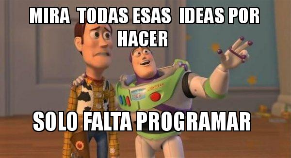

## Trabajo individual para la asignatura "Big Data"

<!-- El párrafo de abajo has de dejarlo tal cual. NO HAS DE CAMBIAR NADA!!-->

Repo utilizado para elaborar el trabajo para la asignatura "Programación y manejo de datos en la era del Big Data" de la Universitat de València durante el curso 2021-2022. La página web de la asignatura puede verse aquí: <https://perezp44.github.io/intro-ds-21-22-web/>.

<!-- En la linea de abajo TIENES QUE SUSTITUIR "perezp44" por tu usuario de Github-->
La versión final del trabajo puede visualizarse en: <https://vanesarr.github.io/trabajo_BigData/>. 

<!-- Abajo podéis escribir lo que queráis, igual un resumen del trabajo, o ..., o ... pero al menos, creo que tienes que poner el título del trabajo y posiblemente tu nombre. Algo que explique porque está el repo en Github-->

El título del trabajo es la Evolución de la Universidad de Valencia.  En el trabajo se harán distantas evoluciones de distintas variables donde se pretende mostrar visualmente como se ha desarrolado la UV a través de los años.

Para hacer todo esto se pondrá en práctica lo estudiado en la asignatura de **Programación y manejo de datos en la era del Big Data** que se cursa en **CUARTO** de la carrera de **Economía** en la **UV**.

 

<!-- Finalmente, ACÚERDATE de que cuando hayas hecho los cambios y hayas dejado este archivo como te guste más, TIENES que knittearlo para que los cambios se actualicen en el fichero Readme.md, que es el que finalmente se visualizará en Github. El fichero Readme.md no has de editarlo a mano, sale de knittear Readme.Rmd-->

